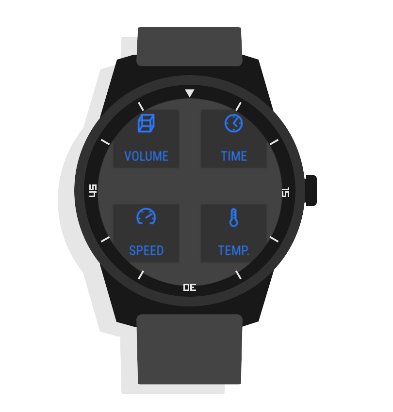

# Everyday Converter

Everyday Converter is an easy to use application to convert between different units such as units of length, volume, time or weight. It is available for both Android on mobile phones or tablets and Wear OS for wearable devices and smartwatches.

# Android application

# Wear OS allplication

