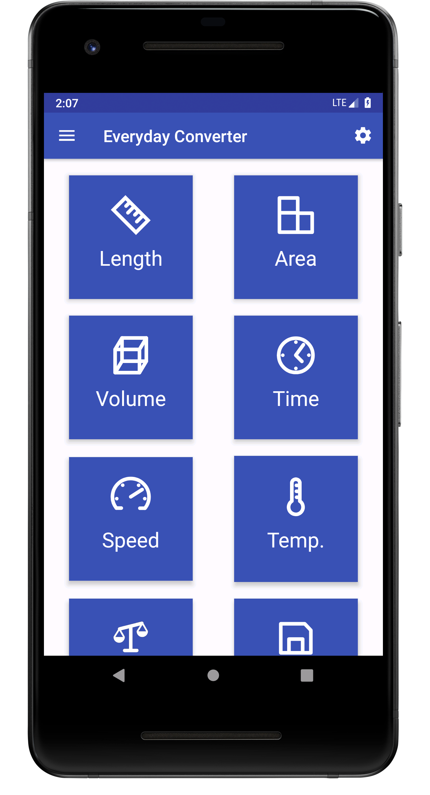
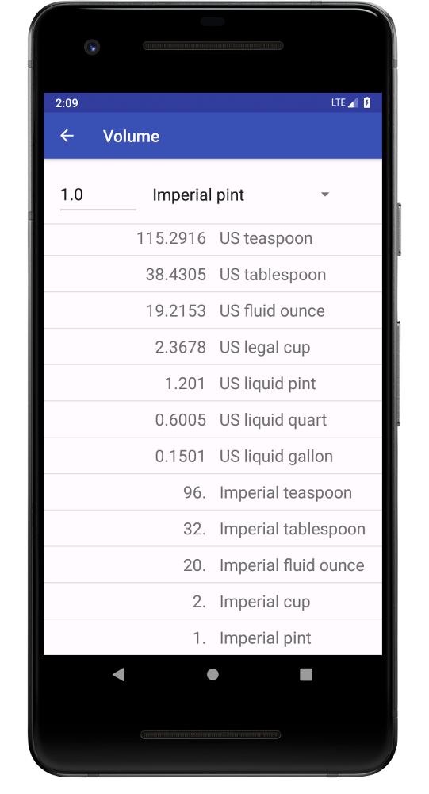
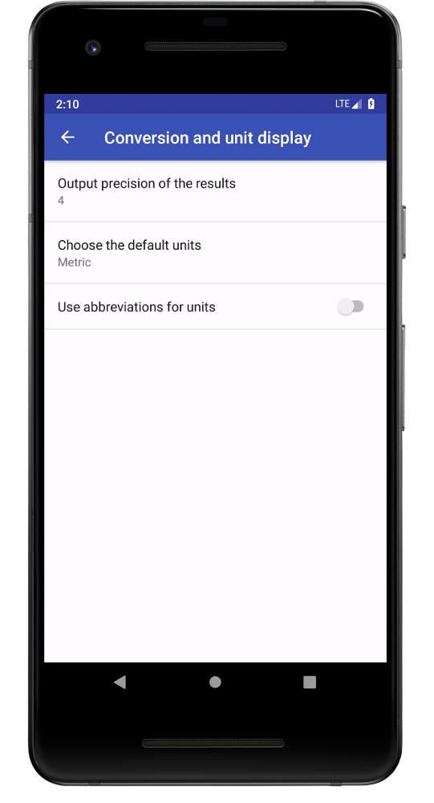

# What is Everyday Converter?

Everyday Converter lets you convert between basic units used in everyday live. Currently, the categories are length, area, volume, time, speed, temperature, weight, and data storage. In each category, conversions between the the most common metric and imperial units are available. Ever wonder what the difference between a US pint and an imperial pint is? How many minutes there are in a day? What is an acre? Wonder no more! All these questions can be answered with the help of this easy to use application.

[Get it in the Play Store!](https://play.google.com/store/apps/details?id=io.github.sebmerkt.everydayconverter)

# Android application User Guide
## Main user interface

Open the Everyday Converter on you phone or tablet and you will be provided with a well-structured overview of the unit categories available. Click on one of the category buttons to convert between the respective units.

1. Select the input unit, the one you want to convert from.
2. Enter a number in the top left corner.
3. Scroll through the list to find the desired output unit.

Now we can answer some of the questions we asked earlier. What the difference between a US pint and an imperial pint? From the example we can see that 1 imperial pint is equal to 1.2 US pint. So, next time you're at the pub, better order an imperial pint!

## Settings

In the settings you can change the way Everyday Converter displays the conversion results. Currently, three settings can be adjusted.

1. Output precision of the results: Changes how many digits are shown.
2. Default units: Controls the default input unit: If you are more likely to convert from metric to imperial units, choose metric. If you are more likely to convert from imperial to metric, choose imperial.
3. Use abbreviations for units: Choose to show only abbreviated units. Will show *in* instead of *Inch*, *lb* instead of *Pound*.

## More Information
Get more information on the app in this [blog](https://sebmerkt.github.io/2018/10/09/Android.html) entry and details on the units and their abbreviations [here](https://sebmerkt.github.io/everyday_converter.html).
